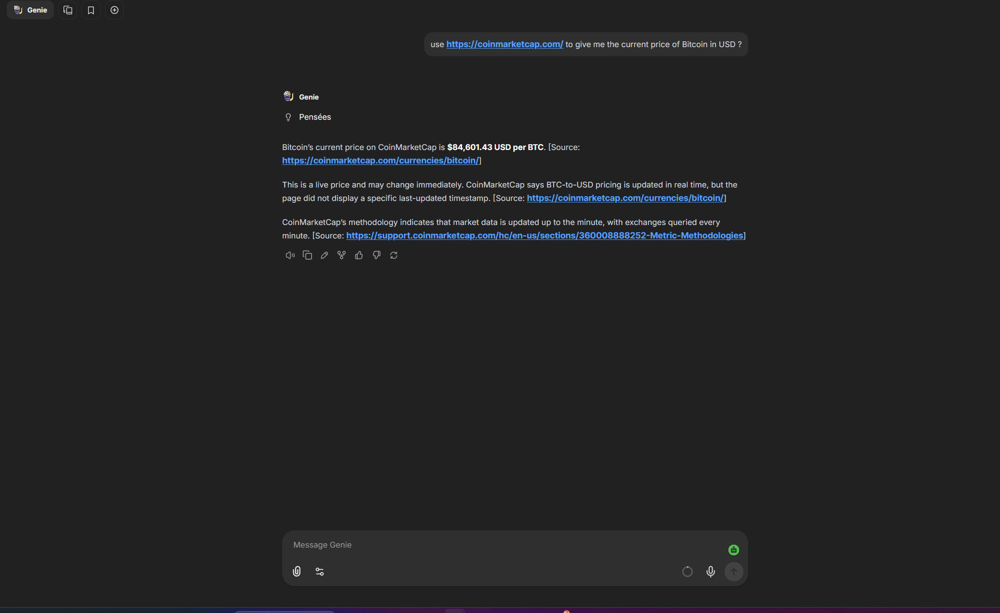

# Genie

A LangGraph research agent (planner → researcher → writer) exposed as an OpenAI-compatible
`/v1/chat/completions` endpoint, with a companion MCP tool server for deep web scraping.



## Architecture

- **`genie`** — the LangGraph agent (FastAPI). Handles planning, iterative web research
  (Tavily search + MCP tools), and answer synthesis. Streams responses in OpenAI-compatible
  SSE format, so it plugs directly into LibreChat as a custom endpoint.
- **`mcp_server`** — a standalone MCP server exposing a `scrape_link` tool (via Firecrawl) for
  fetching full page content as markdown. Genie connects to it over streamable HTTP.

## Prerequisites

- Docker & Docker Compose
- API keys: OpenAI (or your LLM provider), Tavily, Firecrawl

## Setup

1. Copy the example env file and fill in your keys:

   ```bash
   cp .env.example .env
   ```

2. Launch everything:

   ```bash
   docker compose up --build
   ```

3. The agent is available at:

   ```
   http://localhost:<port>/v1/chat/completions
   ```

   Point LibreChat (or any OpenAI-compatible client) at this URL as a custom endpoint.

## Stopping

```bash
docker compose down
```

## Notes

- `mcp_server` must be healthy before `genie` starts — Compose handles this via
  `depends_on` / health checks.
- Environment variables are documented in `.env.example`.