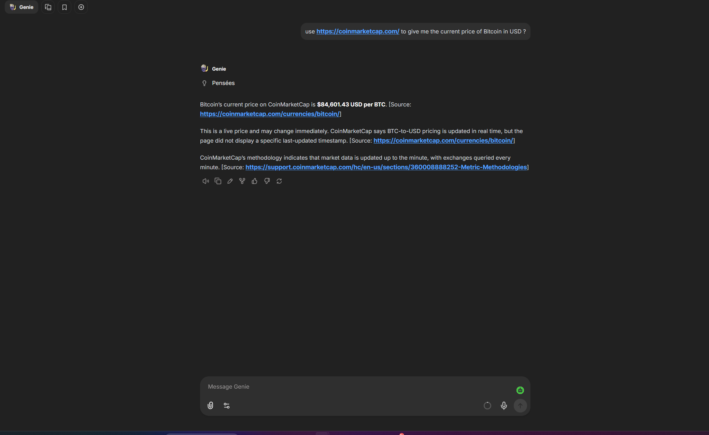

# Genie

A LangGraph research agent (planner → researcher → writer) exposed as an OpenAI-compatible
`/v1/chat/completions` endpoint, with a companion MCP tool server for deep web scraping.
Observability and prompt management use a self-hosted [Langfuse](https://langfuse.com) instance.



## Architecture

- **`api`** — the LangGraph agent (FastAPI). Handles planning, iterative web research
  (Tavily search + MCP tools), and answer synthesis. Streams responses in OpenAI-compatible
  SSE format, so it plugs directly into LibreChat as a custom endpoint.
- **`mcp`** — a standalone MCP server exposing a `scrape_link` tool (via Firecrawl) for
  fetching full page content as markdown. Genie connects to it over streamable HTTP.
- **Langfuse (external)** — self-hosted prompt management + tracing. Genie loads chat prompts
  at startup and emits per-request traces for graph, model, and tool activity.

## Technology stack

| Component | Version / notes |
|-----------|-----------------|
| Python | 3.12+ (Docker image uses 3.12; local `uv` may select a newer compatible runtime) |
| FastAPI + Uvicorn | API server |
| LangGraph / LangChain | Agent orchestration |
| Langfuse Python SDK | Prompt management + LangChain/LangGraph callbacks |
| Tavily + MCP/Firecrawl | Web research tools |
| LibreChat | Optional OpenAI-compatible UI (Compose service) |
| uv | Dependency lock/sync (`app/uv.lock`) |

## Project structure

```
Genie/
├── app/                    # FastAPI + LangGraph agent
│   ├── agents/genie_graph.py
│   ├── api/routes/         # health, models, completions
│   ├── core/               # settings, Langfuse helpers
│   ├── schemas/
│   ├── main.py
│   ├── pyproject.toml
│   └── uv.lock
├── mcp/                    # MCP scrape server
├── utils/                  # shared SSE/logging helpers
├── tests/                  # pytest suite
├── librechat/              # LibreChat config mounts
├── .cursor/                # AI agent guidance: RULES.md, SKILLS.md
├── docker-compose.yml
├── .env.example
├── README.md
└── DEVELOPMENT.md
```

## Prerequisites

- Docker & Docker Compose
- API keys: OpenAI (or your LLM provider), Tavily, Firecrawl (`FC_KEY` for MCP)
- Access to a self-hosted Langfuse project (public key, secret key, base URL)
- In Langfuse, create **chat** prompts named exactly:
  - `planner-prompt`
  - `researcher-prompt`
  - `writer-synth-prompt`
  
  Preserve the same template variables used previously in LangSmith Hub (for example
  `date`, `chat_history`, `question`, `MAX_SEARCHES`, `bullets`, `notes`).

## Setup

1. Copy the example env file and fill in your keys:

   ```bash
   cp .env.example .env
   ```

2. Set Langfuse credentials in `.env`:

   ```bash
   LANGFUSE_PUBLIC_KEY=pk-lf-...
   LANGFUSE_SECRET_KEY=sk-lf-...
   LANGFUSE_BASE_URL=https://langfuse.example.com
   ```

3. Launch everything:

   ```bash
   docker compose up --build
   ```

4. The agent is available at:

   ```
   http://localhost:8000/v1/chat/completions
   ```

   Point LibreChat (or any OpenAI-compatible client) at this URL as a custom endpoint.
   LibreChat UI defaults to `http://localhost:3080`.

### Local dependency install (optional)

```bash
cd app
uv sync --group dev
```

## Environment variables

Documented fully in [`.env.example`](.env.example). Genie-specific variables:

| Variable | Required | Description |
|----------|----------|-------------|
| `MODEL_NAME` | yes | Chat model used by the agent |
| `OPENAI_API_KEY` | yes | Provider API key for the chat model |
| `MCP_SERVER_URL` | yes | MCP streamable HTTP URL (Compose: `http://mcp:8080/mcp`) |
| `TAVILY_API_KEY` | yes | Web search tool |
| `ACCESSIBLE_MODELS` | no | Models advertised on `/v1/models` |
| `LOG_LEVEL` | no | Logging level (default `INFO`) |
| `LANGFUSE_PUBLIC_KEY` | yes | Langfuse project public key |
| `LANGFUSE_SECRET_KEY` | yes | Langfuse project secret key |
| `LANGFUSE_BASE_URL` | yes | Self-hosted Langfuse API base URL |

`LANGSMITH_API_KEY` is no longer used. LangSmith may still appear transitively via LangChain.

## API endpoints

| Method | Path | Description |
|--------|------|-------------|
| `GET` | `/health` | Health check |
| `GET` | `/v1/models` | List accessible models |
| `POST` | `/v1/chat/completions` | OpenAI-compatible chat (streaming + non-streaming). Title requests use the `TITLE_REQUEST::` marker. |

## Frontend / client features

- LibreChat custom endpoint integration (Compose service `librechat`)
- Streaming SSE with intermediate reasoning/status events from planner/researcher/writer
- Conversation title generation for LibreChat

## Testing

From the repo root (uses `app` virtualenv):

```bash
cd app
uv sync --group dev
uv run pytest ../tests -v
```

Covered today:

- Langfuse settings + chat prompt conversion/linking
- Startup-style prompt load failures (missing/wrong type/fallback)
- Per-request callback wiring for title, streaming, and non-streaming paths

After deploying with real Langfuse credentials, smoke-test:

1. Non-streaming `POST /v1/chat/completions`
2. Streaming `POST /v1/chat/completions` with `"stream": true`
3. Confirm one coherent trace per request in Langfuse, with nested planner/researcher/tool/writer spans and linked prompt versions

## Stopping

```bash
docker compose down
```

## Deployment notes

- Langfuse is **not** started by this Compose file; Genie talks to your existing self-hosted instance via `LANGFUSE_BASE_URL`.
- The API container loads prompts during FastAPI startup. Missing credentials, unreachable Langfuse, or missing chat prompts cause startup to fail fast.
- Trace export is best-effort and must not turn a successful completion into an API error; pending events are flushed on shutdown.
- Rebuild/push images with the existing GitHub Actions workflow when cutting a release tag. The workflow fails the image on HIGH or CRITICAL findings that already have a vendor fix.
- `Dockerfile-api` and `Dockerfile-mcp` run `apt-get upgrade` on `python:3.12-slim` so Debian security updates (currently OpenSSL `3.5.7-1~deb13u3` and PCRE2 `10.46-1~deb13u3`) are applied before that scan.

## Recent changes

See [DEVELOPMENT.md](DEVELOPMENT.md) for the detailed migration log.
